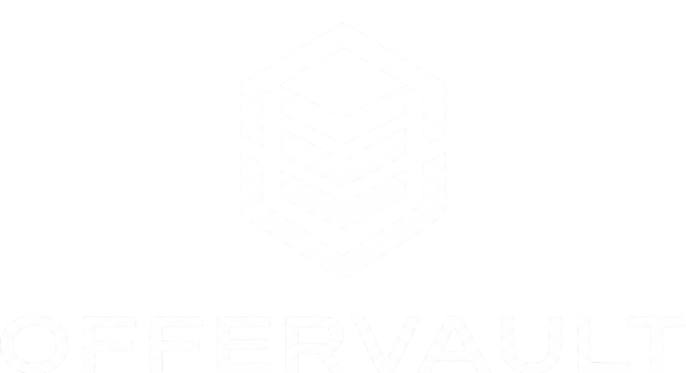

<p align="center">
  
</p>


# 🏛️ OfferVault

> **The Peer-to-Peer Data Consortium for Engineering Placements.**

OfferVault is a high-trust analytics platform built to solve the information asymmetry in Indian engineering placements. By utilizing **Institutional Email Verification (.edu/.ac.in)**, the platform ensures that 100% of the crowdsourced compensation data is verified by university affiliation while maintaining total user anonymity.

[**Live Platform →**](https://offervault.vercel.app/)

---

## 🛡️ Trust & Security Architecture

- **Institutional Guardrails:** Custom domain validation logic that restricts submissions to verified university email addresses.
- **Anonymity Layer:** Multi-layer hashing to protect student identities while allowing for verified participation.
- **Row-Level Security (RLS):** Supabase RLS policies ensuring users can only manage their own data.
- **CTC Benchmarking:** Automated logic to break down offer letters into Base Pay, Joining Bonus, and ESOPs.

## ⚙️ Technical Stack

| Layer | Technology |
|-------|-----------|
| Framework | Next.js 15 (App Router) |
| Styling | Tailwind CSS + Framer Motion |
| Database | Supabase (PostgreSQL) |
| Auth | Supabase Auth |
| Deployment | Vercel Edge Network |
| Icons | Lucide React |

## 🚀 Key Features

- **Verified Submission:** Strict regex filtering for institutional email domains.
- **Leaderboard:** Ranking companies based on verified compensation benchmarks.
- **Advanced Search:** Filter by Role, Company, and Batch.
- **Dashboard:** Secure portal for students to manage their submissions.
- **Compare Tool:** Side-by-side institutional placement analysis.

## 🛠️ Development

1. Clone the repo:
```bash
git clone https://github.com/Sidhant0707/offervault.git
```

2. Install dependencies:
```bash
npm install
```

3. Create `.env.local`:


NEXT_PUBLIC_SUPABASE_URL=your_url
NEXT_PUBLIC_SUPABASE_ANON_KEY=your_key


4.  Run local server:
```bash
npm run dev
```

---

<p align="center">
Built by <b>Sidhant Kumar</b><br/>
<a href="https://www.linkedin.com/in/sidhant07">LinkedIn</a> • <a href="https://github.com/Sidhant0707">GitHub</a>
</p>

